# Aether Forge - Sprint 1 Planı (MVP Core Pipeline)

*   **Sprint Süresi:** 2 Hafta
*   **Sprint Hedefi:** Kullanıcının React tabanlı Node Editör'e bir prompt girip, bunu Runtime Engine üzerinde çalıştırarak Meshy/Tripo AI ile 3D model üretmesini ve üretilen modelin Unreal Engine editörüne otomatik olarak aktarılmasını (import) sağlamak.

---

## 1. Roller ve Sorumluluk Dağılımı (Subagent Görevleri)

### 📋 Product Owner Agent
*   **Görev:** MVP kapsamında kullanıcı hikayelerini (user stories) ve kabul kriterlerini (acceptance criteria) hazırlamak.
*   **Çıktılar:**
    *   `docs/sprint/USER_STORIES.md` (Kullanıcı Akışı ve Kabul Kriterleri)
    *   `docs/sprint/MVP_BACKLOG.md` (Önceliklendirilmiş yapılacaklar listesi)

### 📐 Chief Architect Agent
*   **Görev:** Node Editör, Runtime Engine ve Unreal Engine entegrasyon katmanı arasındaki API veri modellerini (JSON Schema) ve sistem şemasını çizmek.
*   **Çıktılar:**
    *   `docs/sprint/API_SPECIFICATION.md` (Tüm servisler arası haberleşme sözleşmesi)
    *   `docs/sprint/DATA_FLOW.md` (DataPacket taşıma formatı doğrulaması)

### 💻 React Architect Agent
*   **Görev:** React Flow kullanarak temel node editör tuvalini (canvas) hazırlamak. Node ekleme, silme, portları bağlama ve grafiği JSON olarak dışa aktarma (export) özelliklerini kodlamak.
*   **Çıktılar:**
    *   React Flow Canvas bileşeni
    *   Görsel Input (Prompt) ve Output (Mesh) node şablonları
    *   JSON Graph Exporter fonksiyonu

### ⚙️ Runtime Engineer Agent
*   **Görev:** Node SDK sözleşmesine uygun, JSON grafiğini alıp Topological Sort ile sıralayarak çalıştıran bir DAG Scheduler motoru yazmak.
*   **Çıktılar:**
    *   `WorkflowExecutor` (Graph işleme ve port eşleme motoru)
    *   `ExecutionContext` ve `DataPacket` taşıma katmanları
    *   Asenkron iş kuyruğu (Job Queue) prototipi

### 🤖 LLM Integration Agent
*   **Görev:** Model Context Protocol (MCP) gateway altyapısını kurmak ve LLM / Ajanların dış araç çağrılarını (tool calling) yapabilmesini sağlamak.
*   **Çıktılar:**
    *   MCP Gateway Client entegrasyonu
    *   LLM Prompt node entegrasyonu (OpenAI / Gemini)

### 🧠 Multi-Agent Architect Agent
*   **Görev:** Ajanlar arası koordinasyon için temel mesajlaşma veriyolunu (Message Bus) ve "Supervisor-Worker" modelini kurmak.
*   **Çıktılar:**
    *   Ajanlar arası iletişim kanalları (Message Bus)
    *   Supervisor Agent karar döngüsü prototipi

### 🎨 3D Pipeline Agent
*   **Görev:** Meshy veya Tripo AI API'si ile haberleşen node'u yazmak. Ham promptu alıp GLB/OBJ olarak 3D model üretmesini sağlamak.
*   **Çıktılar:**
    *   `Meshy3DGeneratorNode` (Prompt input, Mesh output portları ile)
    *   Dosya indirme ve yerel önbelleğe alma (Caching) sistemi

### 🎮 Unreal Architect Agent
*   **Görev:** Unreal Engine Python API'sini kullanarak dışarıdan gelen GLB dosyasını `Content/Characters/` altına isimlendirme standartlarına uygun import eden editör scriptini yazmak ve bunu MCP tool olarak tanımlamak.
*   **Çıktılar:**
    *   `unreal_import_helper.py` (Editör Python scripti)
    *   Unreal MCP Tool entegrasyonu (`ImportAsset` komutu)

---

## 2. Haftalık Çalışma Takvimi

```mermaid
gantt
    title Sprint 1 Geliştirme Akışı (14 Gün)
    dateFormat  D
    axisFormat Day %d
    
    section Hazırlık & Tasarım
    Gereksinimler & Şemalar (PO & Architect)    :active, day1, 1, 3
    section Frontend & UI
    React Flow Tuval Geliştirme (React Arch)     : day4, 4, 8
    section Runtime & SDK
    DAG Scheduler & Execution (Runtime Eng)    : day4, 4, 9
    section AI & Ajanlar
    MCP Gateway & Message Bus (LLM & Multi-Agent): day5, 5, 9
    3D Model Üretim Node (3D Pipeline)           : day7, 7, 10
    section Unreal Entegrasyonu
    Unreal Python Import Script (Unreal Arch)    : day8, 8, 11
    section Entegrasyon & Test
    Uçtan Uca Entegrasyon Testi (Tüm Ekip)        : day12, 12, 14
```

---

## 3. Kabul Kriterleri (Sprint Definition of Done)
1.  **Görsel Arayüz:** Kullanıcı tarayıcıda bir Prompt Node ve bir 3D Model Node oluşturup bunları birbirine bağlayabilmeli.
2.  **Runtime Çalışması:** Run butonuna basıldığında, grafik JSON formatına çevrilip Runtime'a gitmeli ve sırasıyla Prompt -> Meshy API -> GLB Output adımları hata almadan tamamlanmalı.
3.  **Unreal Engine Import:** Üretilen GLB dosyası otomatik olarak yerelde açık olan Unreal Engine projesinin `Content/Characters/SM_KarakterAdi` altına yüklenmeli ve editörde görünmeli.
